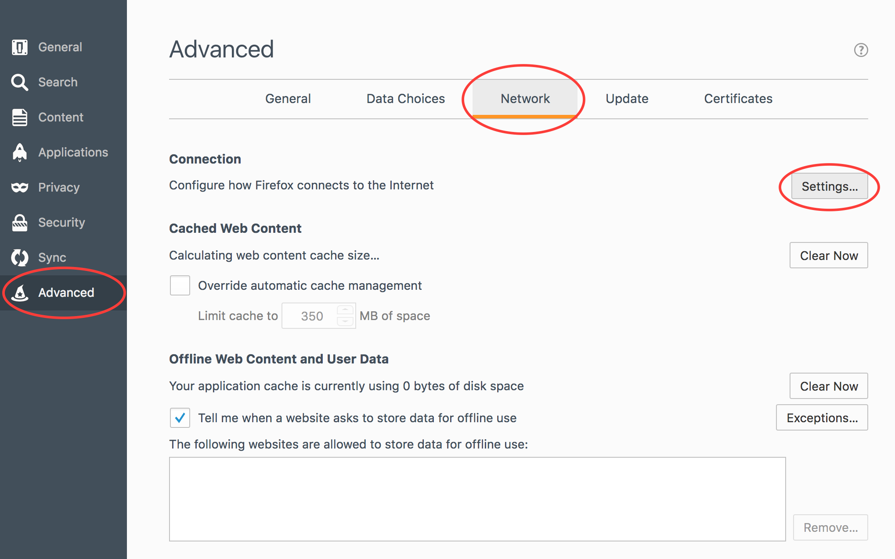
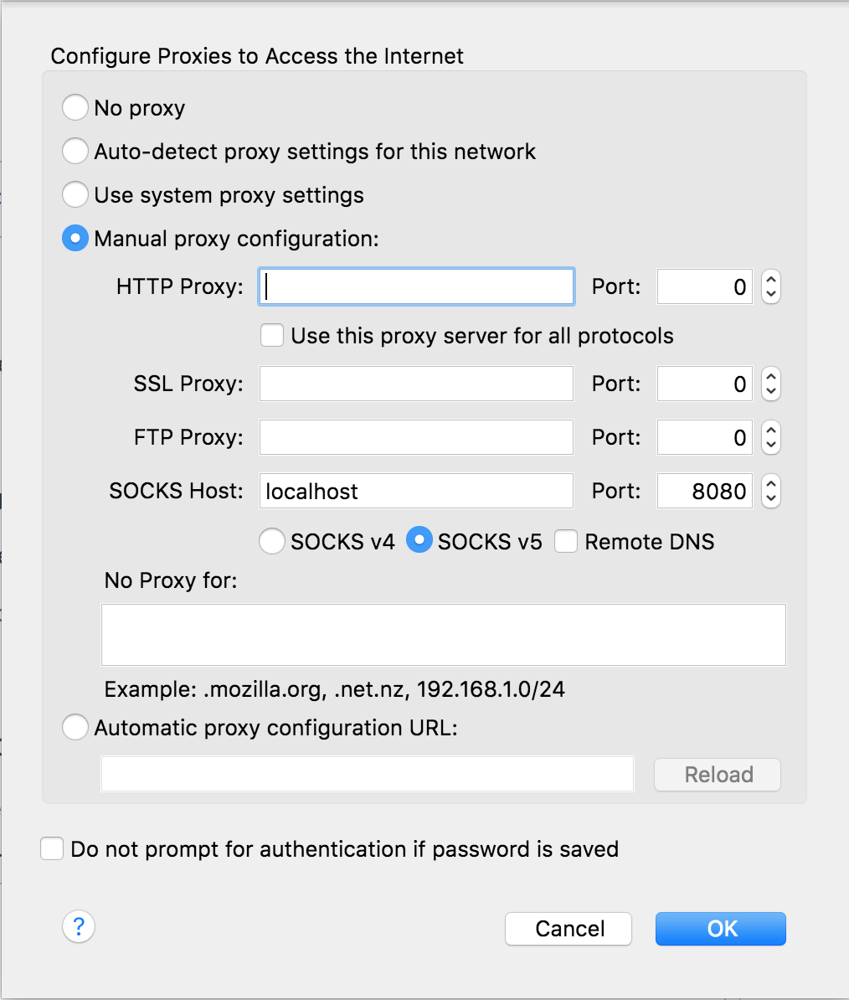

# Using SSH to view a remote website

Imagine you have a site running on `localhost:3000` on a remote development server and you would like to browse the site on your local machine. SSH makes this a snap with [Dynamic Port Forwarding](https://help.ubuntu.com/community/SSH/OpenSSH/PortForwarding#Dynamic_Port_Forwarding)!

## Step 1

Start a SOCKS proxy with SSH. Run the following command in the terminal:

```
ssh -CN -D 8080 user@hostname
```

This will dynamically forward traffic through port 8080 to the specified server. 8080 can be substituted with any unused port.

## Step 2

Configure your browser to send traffic through the SOCKS proxy (Firefox screenshots below). Ensure that the port you specify matches the port specified in the SSH command above.

You should now be able to visit `http://localhost:3000` and the traffic will be forwarded to your remote server!



